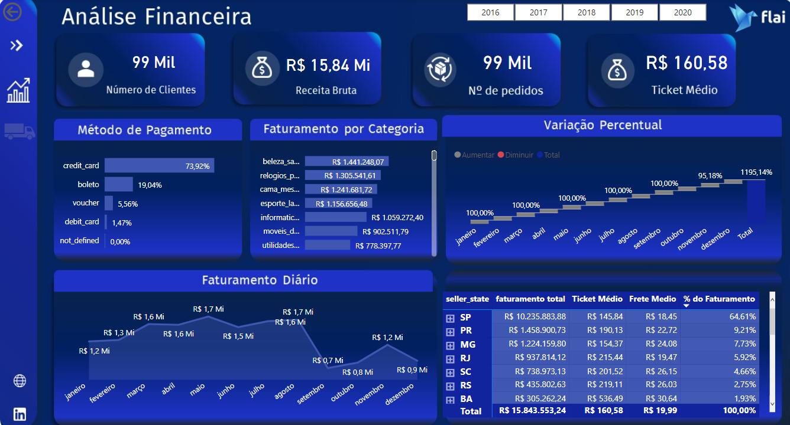
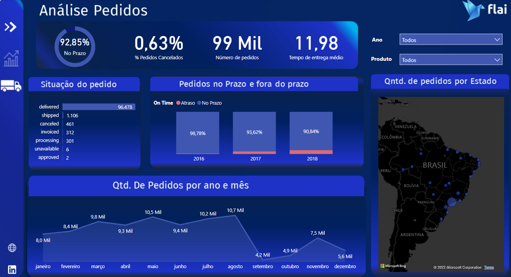

# Projeto: E-Commerce

## Introdução do problema
Fazer a gestão financeira e de logística é necessária para manter uma empresa de e-commerce funcionando. Conhecer a receita bruta, número de pedidos, faturamento por categoria, quantidade de pedidos por mês, tempo médio de entrega, porcentagem de pedidos entregues no prazo são algumas métricas necessárias para uma boa gestão da empresa.

**Problema:** Melhorar as vendas de um e-commerce

**Objetivo:** Fazer uma análise financeira de todas as compras no e-commerce (ticket médio, faturamento, variação percentual) e uma análise dos pedidos (dias com mais pedidos, porcentagem de pedidos entregues, relação de pedidos entregues no prazo e atrasados).

**Dataset:** É um conjunto de dados públicos de e-commerce brasileiro de pedidos feitos na Olist Store. O conjunto de dados tem informações de 100 mil pedidos de 2016 a 2018 feitos em vários marketplaces no Brasil. Dados foram extraídos do Kaggle (https://www.kaggle.com/datasets/olistbr/brazilian-ecommerce).

## Desenvolvimento

**Ferramenta:** Power BI na criação do dashboard e o tratamento dos dados (ETL) no Power Query Editor, e análise e cálculos de dados usando fórmulas DAX.

**Resultados:** Para este problema da análise do e-commerce foram realizadas duas análises: financeira e de pedidos.

Na análise financeira foram analisadas as seguintes variáveis: número de clientes, receita bruta, número de pedidos, ticket médio, método de pagamento, faturamento por categoria, variação percentual mensal, faturamento mensal. E por estado analisado o faturamento total, ticket médio, frete médio e a porcentagem do faturamento.

A quantidade de clientes é 99 mil com uma receita bruta de R$ 15,84 milhões em 99 mil pedidos entre os anos de 2016 a 2018. O ticket médio por pedido é R$ 160,58. O método de pagamento mais usado é o cartão de crédito e a categoria com maior faturamento é de produtos de beleza e saúde. O maior faturamento mensal em 2017 é em novembro e o estado com maior faturamento é São Paulo com ticket médio de R$ 145,77. A variação percentual mensal de 2017 mostra que os meses de abril, junho  e dezembro tem diminuição na receita.

Na análise logística de pedidos foram analisadas as seguintes variáveis: a porcentagem de pedidos entregues dentro do prazo e de pedidos cancelados e o tempo médio de entrega. Qual é a situação dos pedidos. Quantos pedidos foram entregues no prazo e quantos fora do prazo, a quantidade de pedidos analisados por mês, qual é o número de pedidos em relação ao estado. Com estas análises é possível ver como está a parte de entrega do e-commerce.

Analisando os pedidos 92,85% das compras são entregues no prazo, o tempo médio de entrega é de 12 dias, e a taxa de pedidos cancelados é de 0,63%. Analisando no decorrer dos anos nota-se que a porcentagem de pedidos entregues no prazo está diminuindo. Em 2016 foi de 98,78%, em 2017 de 93,62% e em 2018 de 90,84%. Na situação de pedido temos que 96,478 mil pedidos já foram entregues, 1106 pedidos estão em percurso e 461 foram cancelados. E o estado que mais tem pedido é São Paulo.

## Conclusão

A partir dessa análise os resultados mostram que o e-commerce tem uma porcentagem boa de pedidos entregues no prazo, mas que diminuiu com o passar dos anos, então é um campo para implementar melhorias. Além de analisar com detalhes as categorias e meses que tem menos faturamento.

**Para acessar e navegar pelo dashboard no Power BI**, clique [aqui](https://app.powerbi.com/view?r=eyJrIjoiYzNiZGM3NDUtOTUxNC00OTYzLWJkN2ItY2RhODMwNDIwYWJhIiwidCI6IjY1OWNlMmI4LTA3MTQtNDE5OC04YzM4LWRjOWI2MGFhYmI1NyJ9&pageName=ReportSection6268f799b7ba7518cc5b)

Projeto desenvolvido no curso "Data Insights" do Programa Dominando Data Science 3.0 oferecido pela FLAI - Inteligência Artificial e Data Science. 
